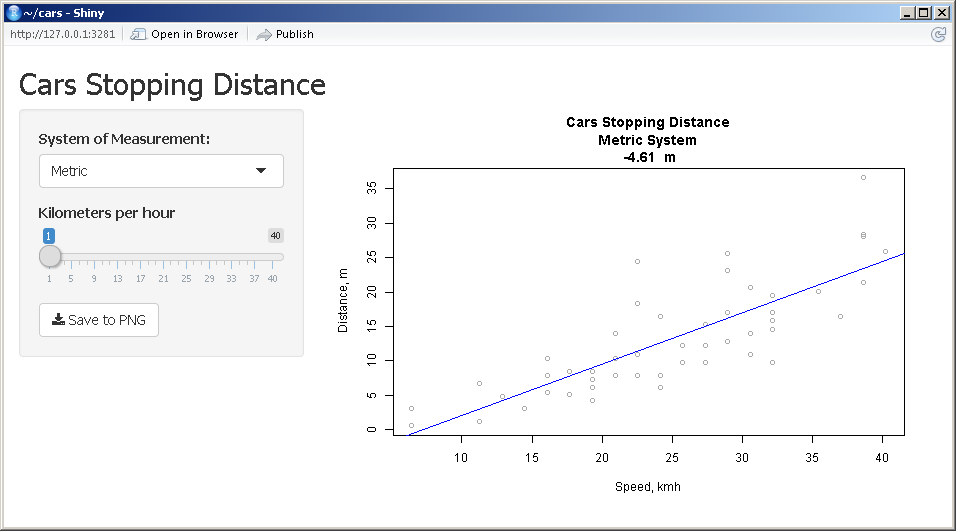

This is a Readme File for Developing Data Products Project.

Project is a shiny application which you can run anywhere. This shiny app was built to help you study reactive features.

Application simply does plot of "cars" data with simple linear interpolation. You can change value of
X axis and see the fitted value in the caption.

Moreover you can use two measurement systems: Metric and Imperial. First of all you should decide which measurement system is better for you and after that all will be changed to values from measurement system that you have choose: slide bar for Speed and of course the plot.

After that you can save your plot to PNG file.

Have a fun.
Thanks

